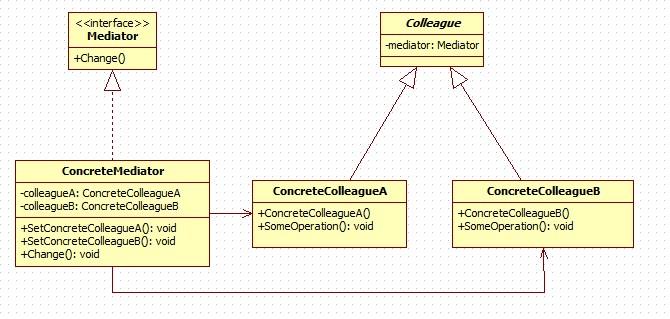

## 来源
http://www.cnblogs.com/zxj159/p/3466115.html

### 一、引出模式

在生活中，当电脑缺少了一块主板，那会怎么样？如果有人这样问我的话，我就会马上跳出来说“这电脑肯定报废了”，当然这不是重点。假如少了主板电脑还可以用的话，想想，里面的CPU、显卡、声卡、光驱、硬盘等等，不是就要我们自己用线把它们连起来。想想就觉得头疼，那么现在你觉得主板在电脑里扮演着什么角色呢？

在软件的开发过程中，势必会碰到这样一种情况，多个类或多个子系统相互交互，而且交互很繁琐，导致每个类都必须知道他需要交互的类，这样它们的耦合会显得异常厉害。牵一发而动全身又不木有啊！

好了，既然问题提出来了，那有请我们这期的主角——中介者模式出场吧！

### 二、认识模式

1.模式定义

用一个中介者对象来封装一系列的对象交互。中介者使得各对象不需要显式地相互引用，从而使其松散耦合，而且可以独立地改变它们之间的交互。

2.解决思路

出现问题的根本原因在于多个对象需要相互交互，导致了紧密耦合，不利于对象的修改和维护。

中介者模式的解决思路，就和“主板”一样，通过引入一个中介对象，让其他对象都只和这个中介者对象交互，而中介者对象是知道怎样和其他对象交互。这样一来，对象直接的交互关系就没有了，从而实现了松散耦合。

对于中介对象而言，所有相互交互的对象，都视为同事类，中介对象就是用来维护各个同事对象之间的关系，所有的同事类都只和中介对象交互，也就是说，中介对象是需要知道所有的同事对象的。

当一个同事对象自身发生变化时，它是不知道会对其他同事对象产生什么影响，它只需要通知中介对象，“我发生变化了”，中介对象会去和其他同事对象进行交互的。这样一来，同事对象之间的依赖就没有了。

有了中介者之后，所有的交互都封装在了中介对象里面，各个对象只需要关心自己能做什么就行，不需要再关系做了之后会对其他对象产生什么影响，也就是无需再维护这些关系了。

3.模式结构

Mediator：中介者接口。在里面定义了各个同事之间相互交互所需要的方法，可以是公共的方法，如Change方法，也可以是小范围的交互方法。

ConcreteMediator：具体的中介者实现对象。它需要了解并为维护每个同事对象，并负责具体的协调各个同事对象的交互关系。

Colleague：同事类的定义，通常实现成为抽象类，主要负责约束同事对象的类型，并实现一些具体同事类之间的公共功能，比如，每个具体同事类都应该知道中介者对象，也就是每个同事对象都会持有中介者对象的引用，这个功能可定义在这个类中。

ConcreteColleague：具体的同事类，实现自己的业务，需要与其他同事对象交互时，就通知中介对象，中介对象会负责后续的交互。

### 三、理解模式

1.中介者模式的功能

中介者的功能就是封装对象之间的交互。如果一个对象的操作会引起其他相关对象的变化，而这个对象又不希望自己来处理这些关系，那么就可以去找中介者，让它来处理这些麻烦的关系。

2.需要Mediator接口吗？

这一问题，首先得弄清楚接口用来干嘛的？接口是用来“封装隔离”的，Mediator接口用来封装中介者对象，使得中介者对象的客户对象跟具体的中介者实现对象分离开。

如果只有一个中介者对象，预期中也没打算扩展，那就可以不定义Mediator接口。

3.同事关系

在标准的中介者模式中，将使用中介者对象来交互的那些对象称为同事类，这是要求这些类都要继承自相同的类，也就是说它们算是兄弟对象。

4.同事和中介者的关系

在模式中，当一个同事对象发生变化时，需要主动通知中介者，让中介者去处理和其他同事对象的相关交互。

这就导致同事对象与中介对象必须有关系，同事对象需要知道中介对象，以便通知；中介对象需要知道同事对象，一边交互。所有它们的关系是相互依赖的。

5.如何实现同事和中介者的通信

一种方式是在Mediator接口中定义一个特殊的通知接口，作为一个通用的方法，让各个同事来调用这个方法。

另一种就是采用观察者模式，把Mediator实现成为观察者，各个同事对象实现为Subject.这些同事对象发生改变时，就会通知Mediator。

6.广义中介者

在实际开发中，经常会简化中介者模式，来是开发变得简单，比如有如下的简化。

l 通常会去掉同事对象的父类，这样可以让任意的对象，只需要有交互，就可以成为同事

l 通常不定义Mediator接口，把具体的中介者对象实现成为单例

l 同事对象不再持有中介者，而是在需要的时候直接获取中介者对象并调用；中介者也不再持有同事对象，而是在具体处理方法里面去创建，或获取，或从数据传入需要的同事对象。

经过这样的简化、变形的情况称为广义中介者。

7.何时选用中介者模式

如果一组对象之间的通信方式比较复杂，导致相互依赖，结构混乱，可以采用中介者模式

如果一个对象引用很多对象，并且跟这些对象交互，导致难以服用该对象

8.模式本质

中介者模式的本质在于“封装交互”

中介者模式的目的，就是封装多个对象的交互，这些交互的多在中介者对象里实现。

只要是实现封装对象的交互，就可以使用中介者模式，不必拘泥于模式结构。

9.相关模式

中介者模式和外观模式

外观模式多用于封装一个子系统内部的多个模块，目的是向子系统外部提供简单易用的接口。

中介者模式是提供多个平等的同事对象之间交互关系的封装，一般是用在内部实现上。

中介者模式和观察者模式

这两个模式可以组合使用。

中介者模式可以组合使用观察者模式，来实现当同事对象发生改变时，通知中介对象，让中介对象去进行与其他相关对象的交互。
